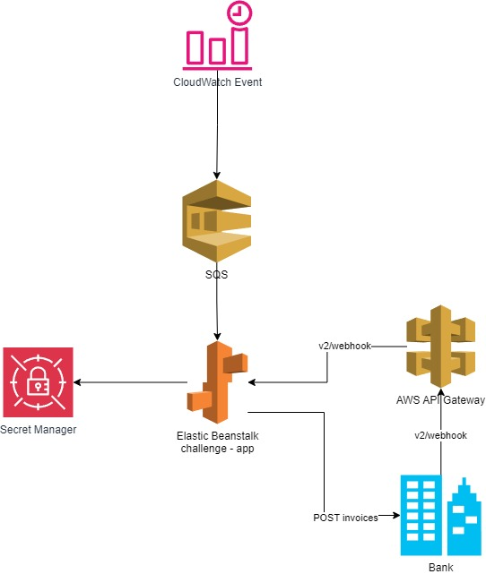

# Challenge


## Descrição

Este projeto é um desafio técnico que envolve:

1. Emissão de faturas (Issues) de 8 a 12 a cada 3 horas para pessoas aleatórias durante 24 horas.
2. Recebimento do webhook de callback da fatura e envio do valor recebido (menos eventuais taxas) para uma conta especifica.

## Arquitetura

Aqui está um diagrama da arquitetura do sistema:



## Uso
1. Crie um Secret Manager na AWS para armazenar a chave privada.
2. Execute o CloudFormation para criar o evento do CloudWatch e a fila SQS.
3. Adicione os parametros (AWS_ACCESS_KEY_ID e AWS_SECRET_ACCESS_KEY) da AWS no _path variables_ ou use o aws cli com o comando ```aws configure``` para gerar o .aws com as credentials.
4. Rode a classe ChallengeApplication.class para executar
5. Outra opção por Docker
    - ```./gradlew clean build ```
    - ``` docker build . ```
    - ```docker build -t challenge-app .```
    - ``` docker run -d -p 8080:8080  -e AWS_ACCESS_KEY_ID="<KEY_ID>" -e AWS_SECRET_ACCESS_KEY="<ACCESS_KEY>" challenge-app```


## API

A API disponível para recebimento de webhooks está acessível em:

- **URL:** [https://dqzzigt9g7.execute-api.us-east-1.amazonaws.com/live/v2/webhook](https://dqzzigt9g7.execute-api.us-east-1.amazonaws.com/live/v2/webhook)

