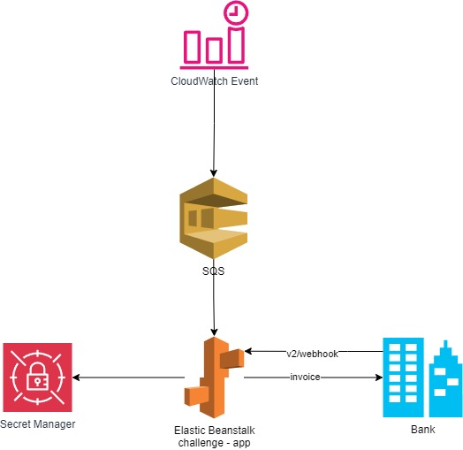

# Challenge

## Descrição

Este projeto é um desafio técnico que envolve:

1. Emissão de faturas (Issues) de 8 a 12 a cada 3 horas para pessoas aleatórias durante 24 horas.
2. Recebimento do webhook de callback da fatura e envio do valor recebido (menos eventuais taxas) para uma conta especifica.

## Arquitetura

Aqui está um diagrama da arquitetura do sistema:

 
## API

A API disponível para recebimento de webhooks está acessível em:

- **URL:** [http://challenge-jonasrbneto.us-east-1.elasticbeanstalk.com/v2/webhook](http://challenge-jonasrbneto.us-east-1.elasticbeanstalk.com/v2/webhook)

